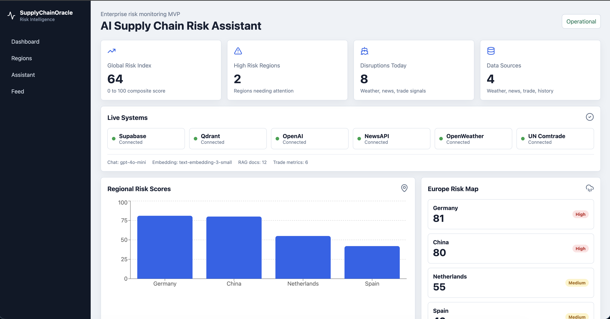
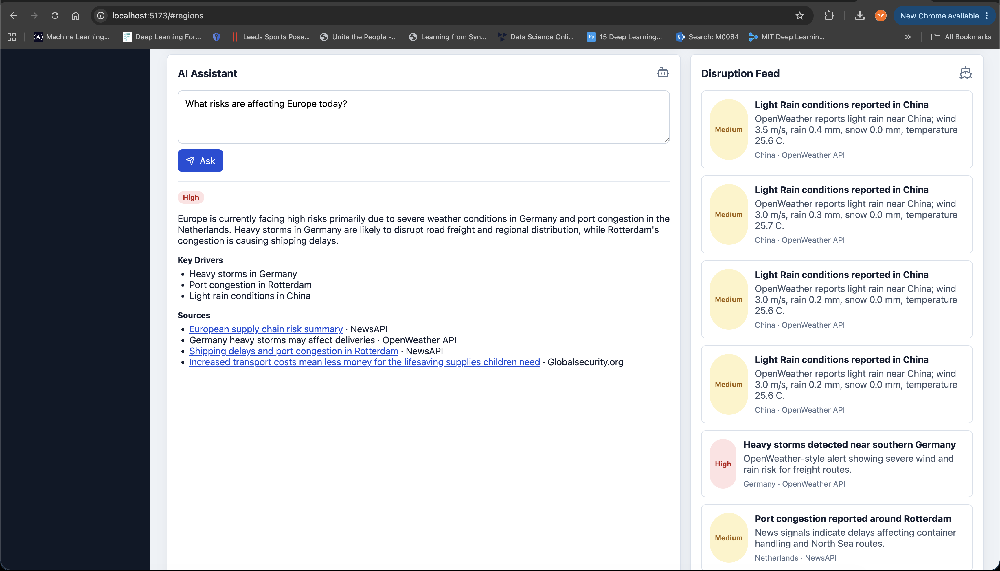
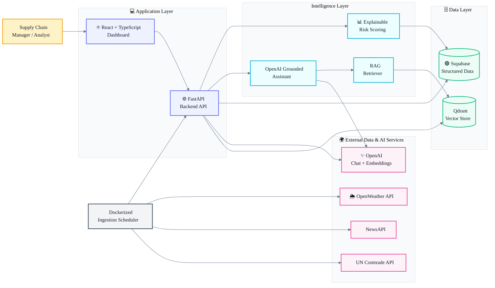

# 🚚 SupplyChainOracle

<p align="center">
  <strong>AI-powered supply chain risk intelligence platform</strong>
</p>

<p align="center">
  Monitor disruptions • Explain risk • Retrieve evidence • Make better decisions
</p>

<p align="center">
  
  
  
  
  
  
  
</p>

---

**SupplyChainOracle is an AI-powered supply chain risk assistant that monitors weather, news, trade activity, and historical delivery signals to help teams understand regional disruption risk.**

This project is built as a practical portfolio application for AI engineering and React product development. It demonstrates how I approach production-style AI systems: grounded retrieval, explainable scoring, live data ingestion, resilient fallbacks, and a dashboard that makes model output auditable instead of opaque.

## 🌟 Why This Project Matters

Supply chain teams often monitor risk through fragmented tools: weather sites, news feeds, port reports, trade data, shipment spreadsheets, and manual analyst notes. That creates slow reaction times and inconsistent visibility.

SupplyChainOracle centralizes these signals into one operational dashboard and an AI assistant that answers questions with citations and live risk context.

## ✅ Highlights

- ✅ Retrieval-Augmented Generation (RAG) using OpenAI + Qdrant
- ✅ Explainable AI risk scoring engine
- ✅ Multi-source ingestion pipeline
- ✅ FastAPI backend architecture
- ✅ React + TypeScript operational dashboard
- ✅ Dockerized multi-service deployment
- ✅ Grounded AI responses with citations
- ✅ Supabase structured persistence
- ✅ CI/CD-ready architecture

## 📸 Application Preview

### Risk Dashboard

<p align="center">
  
</p>

### AI Supply Chain Assistant

<p align="center">
  
</p>

## 🧠 Skills Demonstrated

**AI engineering:**

* Retrieval-augmented generation using OpenAI embeddings and Qdrant
* Grounded OpenAI assistant responses with structured JSON output
* Explainable risk scoring from live and historical signals
* Live ingestion from OpenWeather, NewsAPI, and UN Comtrade
* Supabase-backed persistence with mock-safe fallback behavior
* API-first backend design using FastAPI and Pydantic

**React and frontend engineering:**

* React + TypeScript dashboard architecture
* Recharts visualizations for regional risk
* Operational UI for risk scores, disruption feeds, assistant responses, and live system status
* Resilient frontend fallback data when the backend is unavailable
* Responsive dashboard layout with clear loading and error states

**Engineering approach:**

* Start with a working mock-safe MVP
* Replace mock boundaries with real integrations incrementally
* Keep model output grounded in retrieved data
* Make risk scores explainable and testable
* Preserve deterministic fallback paths for demos and local development

## 🎯 Problem Statement

Supply chain managers and operations analysts need to detect risk early, but important signals are distributed across unrelated sources:

* Weather alerts
* Global logistics and disruption news
* Country-level import/export activity
* Historical delivery delays
* Regional transportation disruptions

Without a centralized view, teams spend time manually collecting information instead of evaluating impact. This can lead to delayed responses, higher costs, inventory issues, missed stakeholder updates, and poor visibility into regional risk.

## 💡 Solution

SupplyChainOracle solves this by combining live data ingestion, explainable scoring, vector search, and an AI assistant.

**The system:**

1. Ingests live signals from OpenWeather, NewsAPI, and UN Comtrade.
2. Stores structured risk data in Supabase.
3. Embeds disruption/news documents with OpenAI embeddings.
4. Indexes documents in Qdrant for semantic retrieval.
5. Calculates regional risk scores from weather, news frequency, negative terms, shipment delays, and trade activity.
6. Serves a React dashboard with risk metrics, regional charts, live system status, and a disruption feed.
7. Answers natural-language questions using retrieved documents and current risk scores.

The assistant is designed to be grounded: it uses supplied risk scores, recent disruptions, and retrieved documents, then returns citations alongside the answer.

## 🏗 What This Demonstrates

| Area | Demonstrated Skills |
|--------|-------------------|
| AI Engineering | RAG, embeddings, retrieval, grounded generation |
| Backend Engineering | FastAPI, API design, orchestration |
| Frontend Engineering | React, TypeScript, data visualization |
| Data Engineering | ETL pipelines, ingestion scheduling |
| Cloud Architecture | Docker, service separation |
| Product Design | Operational dashboards and explainable AI |

## 🔄 High-Level Architecture



## 🛠 Tech Stack

**Frontend:**

* React
* TypeScript
* Recharts
* Lucide icons
* Vite

**Backend:**

* FastAPI
* Pydantic
* httpx
* OpenAI API
* Explainable Python risk engine

**Data and AI infrastructure:**

* Supabase for structured data
* Qdrant for vector search
* OpenAI embeddings for document indexing
* OpenAI chat model for grounded assistant responses

**Ingestion and deployment:**

* Docker Compose
* Dockerized backend, frontend, and ingestion worker
* GitHub Actions CI

## ⭐ Key Features

* Live disruption ingestion from OpenWeather
* Live supply chain news ingestion from NewsAPI
* Live trade metrics from UN Comtrade
* Supabase persistence for regions, documents, disruptions, trade metrics, and shipments
* Qdrant-backed semantic retrieval
* OpenAI assistant with structured output and citations
* Explainable regional risk score recalculation
* Dashboard live systems panel
* Mock-safe local fallback for demos without credentials
* CI workflow for backend tests and frontend builds

## 🚀 How To Run It

### 1. Clone And Configure

```bash
git clone https://github.com/shima-maleki/SupplyChainOracle.git
cd SupplyChainOracle
cp .env.example .env
```

**Fill in the live service values in `.env`:**

```text
OPENAI_API_KEY=
SUPABASE_URL=https://PROJECT_REF.supabase.co
SUPABASE_SERVICE_ROLE_KEY=
QDRANT_URL=
QDRANT_API_KEY=
NEWS_API_KEY=
OPENWEATHER_API_KEY=
UN_COMTRADE_API_KEY=
```

**Optional defaults:**

```text
OPENAI_MODEL=gpt-4o-mini
OPENAI_EMBEDDING_MODEL=text-embedding-3-small
QDRANT_COLLECTION=supply_chain_documents
INGEST_INTERVAL_SECONDS=3600
```

### 2. Prepare Supabase

Run the SQL in `supabase/schema.sql` in the Supabase SQL editor.

**Expected tables:**

* `regions`
* `disruptions`
* `documents`
* `trade_metrics`
* `historical_shipments`

### 3. Run With Docker

```bash
docker compose up --build
```

**Services:**

* Frontend: `http://localhost:5173`
* Backend API: `http://localhost:8000`
* API docs: `http://localhost:8000/docs`

**Trigger ingestion manually:**

```bash
curl -X POST http://localhost:8000/ingest/run
```

### 4. Run Locally Without Docker

**Backend:**

```bash
pip install -r backend/requirements.txt
uvicorn backend.app.main:app --reload
```

**Frontend:**

```bash
cd frontend
npm install
npm run dev
```

## 🔌 API Endpoints

```text
GET  /health
GET  /dashboard
GET  /regions
GET  /disruptions
GET  /documents
GET  /system/status
GET  /risk/scores
POST /risk/recalculate
POST /assistant/chat
POST /ingest/run
```

## 📈 Success Metrics

**Product success:**

* A manager can identify the highest-risk region in under 30 seconds.
* The assistant returns cited, grounded answers for supply chain risk questions.
* The dashboard shows live system connectivity and data freshness signals.
* Risk scores update after ingestion without manual database edits.

**Technical success:**

* Backend tests pass in CI.
* Frontend production build passes in CI.
* Ingestion writes live records to Supabase.
* Documents are embedded and indexed in Qdrant.
* Assistant responses continue to work if OpenAI or Qdrant is unavailable by falling back safely.

**Portfolio success:**

* Demonstrates full-stack AI application development.
* Shows practical RAG, not just prompt-only AI.
* Shows React dashboard implementation for an operational workflow.
* Shows explainable scoring and integration with real-world APIs.

## 📊 Data Notes

This application uses a mix of live data and fallback seed data.

**Live data sources:**

* OpenWeather API for weather conditions and disruption signals
* NewsAPI for supply chain and logistics articles
* UN Comtrade API for import/export trade metrics

**Seed/fallback data:**

* Historical shipment examples are seeded to support local development.
* Mock disruptions/documents remain available when live services are not configured.

**Important data considerations:**

* NewsAPI results can include broad business or logistics-related articles; the assistant is instructed to answer only from retrieved context.
* UN Comtrade values depend on API availability, selected reporting period, and rate limits.
* OpenWeather current-weather signals are treated as operational risk indicators, not official logistics disruption alerts.
* Risk scores are explainable MVP heuristics, not a production forecasting model.
* Secrets must stay server-side. Do not expose OpenAI, Qdrant, or Supabase service-role keys to the browser.

## 📁 Project Structure

```text
frontend/          React dashboard and assistant UI
backend/           FastAPI API, risk scoring, RAG, agent services
ingestion/         Scheduler service for hourly ingestion
supabase/          Supabase schema
docs/              PRD, architecture, and deployment checklist
.github/           CI workflow
```
## 💎 Key Engineering Takeaways

- Built a complete end-to-end AI application rather than a standalone chatbot.
- Implemented explainable risk scoring instead of opaque model outputs.
- Designed retrieval pipelines to ground AI responses in evidence.
- Integrated multiple external APIs into a unified operational workflow.
- Developed a resilient architecture with fallback paths for local development and demos.

## 👤 License

**Shima Maleki**

* GitHub: `shima-maleki`
* Email: `shimamaleki95@yahoo.com`

## 📜 License

This project is licensed under the MIT License.