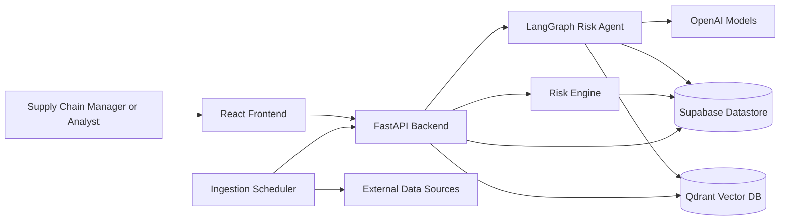
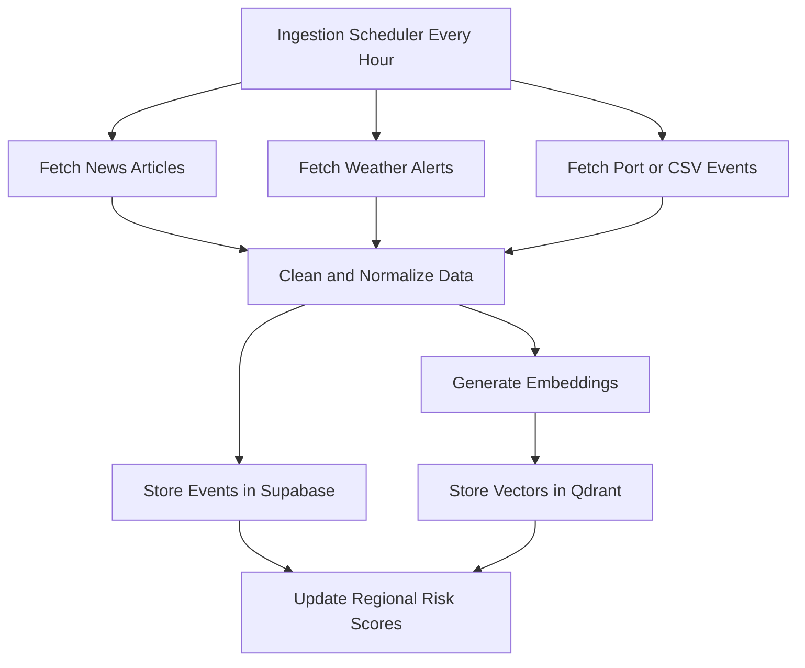
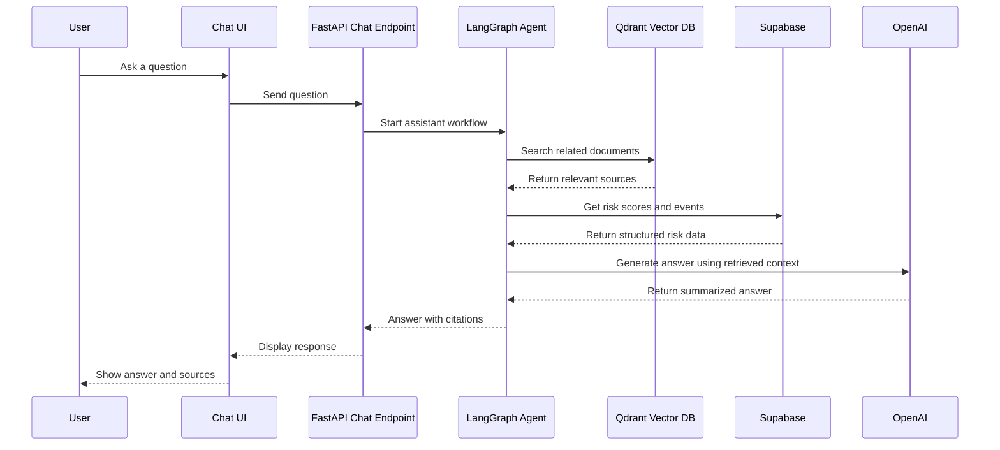
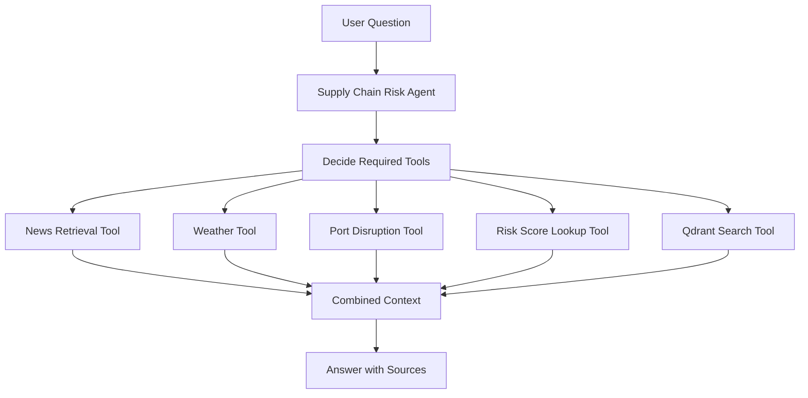
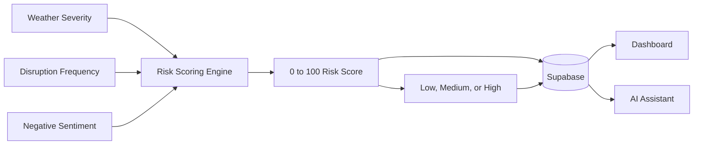
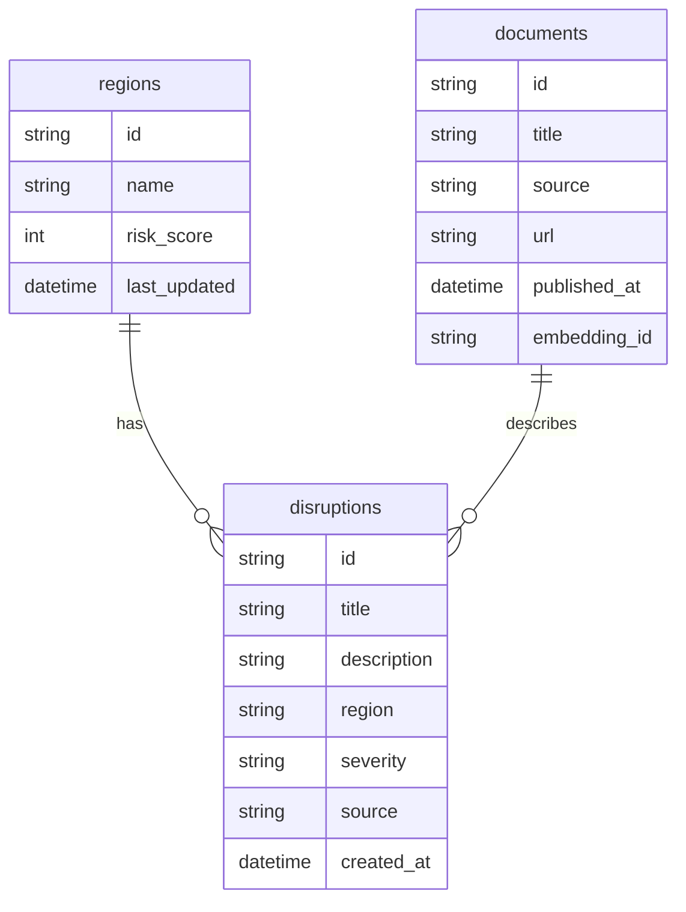
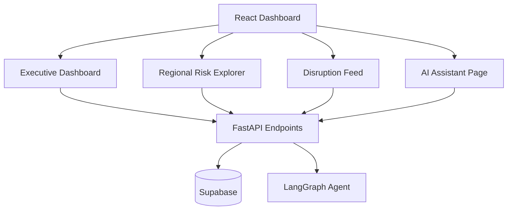
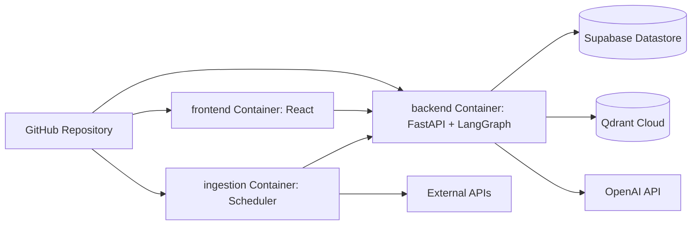
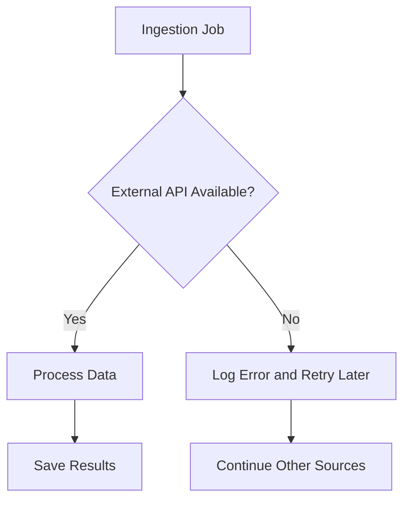

# Architecture

# 1. Purpose

This document explains the technical architecture for the AI Supply Chain Risk Assistant.

It is written for a Junior AI Engineer, so each section explains the main components, how data moves through the system, and where AI is used.

The architecture is based on the MVP described in `docs/PRD.md`.

---

# 2. High-Level System Overview

The platform collects external supply chain risk signals, stores structured risk data, stores searchable document embeddings, and allows users to explore risks through a dashboard and an AI assistant.

## Main Responsibilities

Frontend:

* Shows the dashboard
* Displays regional risk scores
* Displays disruption events
* Provides the chat interface

Backend:

* Provides FastAPI endpoints
* Runs ingestion jobs
* Calculates risk scores
* Handles chat requests

Supabase Datastore:

* Stores regions
* Stores disruption events
* Stores document metadata
* Stores current risk scores

Qdrant:

* Stores vector embeddings
* Enables semantic search for RAG

OpenAI:

* Generates embeddings
* Generates AI assistant responses
* Supports summarization and sentiment analysis

---

# 3. Technology Stack

## Frontend

* React
* TypeScript
* TailwindCSS
* shadcn/ui or equivalent component system
* Recharts
* Leaflet or React Map GL

## Backend

* FastAPI
* Python service modules
* LangGraph
* OpenAI API

## Data Stores

* Supabase datastore for structured application data
* Qdrant Cloud for document vectors

## Deployment

* Docker for local services and deployment packaging
* Separate containers for frontend, backend, and ingestion
* GitHub for source control and CI/CD foundation

---

# 4. Data Ingestion Architecture

The system ingests data every hour from external sources.

MVP sources:

* NewsAPI
* OpenWeather API
* Port Data API or CSV disruption data

Optional future sources:

* UN Comtrade API for trade trend charts
* Kaggle historical datasets for offline analysis or future prediction work

## Ingestion Steps

1. The ingestion scheduler starts the hourly job.
2. The backend fetches data from external APIs.
3. Raw data is cleaned and converted into a common format.
4. Important event details are saved in Supabase.
5. Text content is embedded using an OpenAI embedding model.
6. Embeddings are saved in Qdrant.
7. Regional risk scores are recalculated.

---

# 5. RAG Architecture

RAG means Retrieval-Augmented Generation.

The assistant does not answer only from the language model's memory. It first retrieves relevant documents and risk data, then uses that context to generate an answer with sources.

## RAG Components

Document ingestion:

* Cleans article, weather, and disruption text
* Creates embeddings
* Stores vectors in Qdrant

Retrieval:

* Converts the user question into a search query
* Finds related documents in Qdrant
* Loads related risk records from Supabase

Generation:

* Sends retrieved context to the OpenAI model
* Produces a concise answer
* Includes source citations

---

# 6. Agent Architecture

The Supply Chain Risk Agent decides which tools are needed to answer a user question.

## Agent Tools

News Retrieval Tool:

* Finds recent news articles related to supply chain disruptions

Weather Tool:

* Retrieves weather alerts and severe weather information

Port Disruption Tool:

* Retrieves port congestion, shipping delay, or CSV disruption records

Risk Score Lookup Tool:

* Reads current regional risk scores from Supabase

Qdrant Search Tool:

* Performs semantic search over stored documents

---

# 7. Risk Scoring Architecture

Each region receives a score from 0 to 100.

Risk levels:

* Low
* Medium
* High

Inputs:

* Weather severity
* Disruption frequency
* Negative sentiment

## Suggested MVP Scoring Logic

For the MVP, the scoring model should be simple and explainable.

Example:

* Weather severity contributes up to 40 points
* Disruption frequency contributes up to 40 points
* Negative sentiment contributes up to 20 points

Classification:

* 0 to 39: Low
* 40 to 69: Medium
* 70 to 100: High

This can be improved in future versions with predictive forecasting.

---

# 8. Datastore Architecture

Supabase stores structured data that the dashboard and assistant need.

## Tables

regions:

* Stores each monitored region and its latest risk score

disruptions:

* Stores chronological disruption events

documents:

* Stores metadata for documents that also have vectors in Qdrant

---

# 9. Dashboard Architecture

The dashboard reads structured data from Supabase and sends chat questions to the AI assistant API.

## Pages

Executive Dashboard:

* Global Risk Index
* Risk Trend Chart
* High Risk Regions
* Recent Events

Regional Risk Explorer:

* Interactive map
* Risk breakdown
* Regional trends

AI Assistant:

* Chat interface
* Source citations
* Suggested questions

Disruption Feed:

* Timeline
* Filters
* Severity indicators

---

# 10. Docker Architecture

The MVP uses Docker so recruiters can see a realistic multi-service architecture.

## Environment Variables

The following values should be stored securely in local `.env` files for development and production secrets in deployment:

* `OPENAI_API_KEY`
* `SUPABASE_URL`
* `SUPABASE_SERVICE_ROLE_KEY`
* `SUPABASE_ANON_KEY`
* `QDRANT_URL`
* `QDRANT_API_KEY`
* `NEWS_API_KEY`
* `OPENWEATHER_API_KEY`
* `PORT_DATA_API_KEY`

---

# 11. Reliability and Failure Handling

The system should handle external API failures gracefully.

Examples:

* If News API fails, continue processing weather data.
* If OpenWeather fails, keep the previous weather-based score.
* If embedding generation fails, save the document metadata and retry embedding later.
* If Qdrant search fails, the assistant can still answer using Supabase risk data.

---

# 12. Security Notes

For the MVP:

* Store API keys only in environment variables.
* Do not store sensitive business data.
* Validate user input before sending it to backend services.
* Do not expose server-side datastore credentials to the browser.
* Keep all OpenAI, Supabase service role, and Qdrant calls on the server side.

---

# 13. Junior AI Engineer Implementation Order

Recommended build order:

1. Create the Docker folder structure: `frontend/`, `backend/`, and `ingestion/`.
2. Build the React dashboard with mock data.
3. Create the FastAPI backend with health, regions, disruptions, and assistant endpoints.
4. Create the datastore schema in Supabase.
5. Connect dashboard reads to FastAPI and Supabase.
6. Add hourly ingestion for one source, such as NewsAPI.
7. Store documents and disruption events.
8. Generate embeddings and store them in Qdrant.
9. Add RAG search for the assistant.
10. Add risk scoring.
11. Add OpenWeather and port or CSV disruption data.
12. Add error handling, citations, and monitoring.

This order keeps the project simple while still moving toward the complete MVP.
